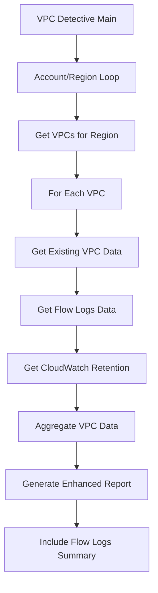

# VPC Flow Logs Detection - Design Document

## Overview

This design extends the existing VPC Detective tool to include VPC Flow Logs detection and reporting capabilities. The enhancement will integrate seamlessly with the current architecture while adding new AWS API calls to gather Flow Logs information and extend the markdown report generation to include Flow Logs status, destinations, and retention settings.

The design maintains the existing multi-account, multi-region scanning approach and follows the same error handling patterns established in the current codebase.

## Architecture

### High-Level Flow



### Integration Points

The Flow Logs detection will integrate at two main points in the existing architecture:

1. **Data Collection Phase**: Add Flow Logs data gathering alongside existing VPC information collection
2. **Report Generation Phase**: Extend markdown generation to include Flow Logs columns and summary statistics

## Components and Interfaces

### New Functions

#### `get_vpc_flow_logs(client, vpc_id)`
**Purpose**: Retrieve Flow Logs configuration for a specific VPC
**Parameters**: 
- `client`: EC2 boto3 client
- `vpc_id`: VPC identifier string
**Returns**: Dictionary containing Flow Logs information
```python
{
    'status': 'Enabled|Disabled|Multiple|Error',
    'destinations': ['CloudWatch', 'S3', 'Kinesis'],
    'retention_days': int or 'Never' or 'N/A'
}
```

#### `get_cloudwatch_retention(logs_client, log_group_name)`
**Purpose**: Get retention period for CloudWatch Log Group
**Parameters**:
- `logs_client`: CloudWatch Logs boto3 client
- `log_group_name`: Log group name string
**Returns**: Retention period in days or 'Never'

#### `calculate_flow_logs_summary(vpc_data_list)`
**Purpose**: Calculate Flow Logs coverage statistics
**Parameters**:
- `vpc_data_list`: List of VPC data dictionaries
**Returns**: Summary statistics dictionary

### Modified Functions

#### `get_vpcs(client)` - Enhanced
- Add Flow Logs data collection for each VPC
- Handle Flow Logs API errors gracefully
- Extend VPC data dictionary with Flow Logs information

#### `generate_markdown(vpc_data_list, account_regions)` - Enhanced  
- Add Flow Logs columns to VPC tables
- Include Flow Logs summary section
- Maintain existing table formatting

## Data Models

### Enhanced VPC Data Structure
```python
vpc_data = {
    # Existing fields
    'vpc_id': str,
    'vpc_name': str,
    'vpc_cidr': str,
    'is_default': bool,
    'igw_present': bool,
    'natgw_count': int,
    'subnet_count': int,
    'interface_count': int,
    'region': str,
    'account_name': str,
    'account_id': str,
    
    # New Flow Logs fields
    'flow_logs_status': str,  # 'Enabled', 'Disabled', 'Multiple', 'Error'
    'flow_logs_destinations': list,  # ['CloudWatch', 'S3', 'Kinesis']
    'flow_logs_retention': str  # '30 days', 'Never', 'N/A', etc.
}
```

### Flow Logs Summary Structure
```python
flow_logs_summary = {
    'total_vpcs': int,
    'vpcs_with_flow_logs': int,
    'vpcs_without_flow_logs': int,
    'coverage_percentage': float,
    'by_account': {
        'account_name': {
            'total': int,
            'enabled': int,
            'disabled': int,
            'percentage': float
        }
    }
}
```

## AWS API Integration

### Required AWS APIs

1. **EC2 DescribeFlowLogs**
   - Purpose: Get Flow Logs configurations for VPCs
   - Filters: `resource-id` (VPC ID), `resource-type` (VPC)
   - Pagination: Yes (handled with paginator)

2. **CloudWatch Logs DescribeLogGroups**
   - Purpose: Get retention settings for CloudWatch destinations
   - Filters: `logGroupNamePrefix`
   - Used only when Flow Logs destination is CloudWatch

### API Call Strategy

```python
# Flow Logs detection pattern
try:
    paginator = client.get_paginator('describe_flow_logs')
    page_iterator = paginator.paginate(
        Filters=[
            {'Name': 'resource-id', 'Values': [vpc_id]},
            {'Name': 'resource-type', 'Values': ['VPC']}
        ]
    )
    # Process flow logs data
except botocore.exceptions.ClientError as error:
    # Handle permissions/API errors gracefully
    return {'status': 'Error', 'destinations': [], 'retention_days': 'N/A'}
```

## Error Handling

### Error Scenarios and Responses

1. **Access Denied for Flow Logs APIs**
   - Log warning message
   - Set status to 'Error'
   - Continue processing other VPCs

2. **CloudWatch Logs Access Denied**
   - Set retention to 'N/A'
   - Log warning about missing CloudWatch permissions

3. **API Rate Limiting**
   - Implement exponential backoff retry
   - Maximum 3 retry attempts
   - Log rate limiting events

4. **Malformed Flow Logs Data**
   - Set status to 'Error'
   - Log detailed error information

### Error Handling Implementation
```python
def safe_get_flow_logs(client, vpc_id):
    try:
        return get_vpc_flow_logs(client, vpc_id)
    except botocore.exceptions.ClientError as error:
        error_code = error.response['Error']['Code']
        if error_code in ['AccessDenied', 'UnauthorizedOperation']:
            print(f"  Warning: No permissions for Flow Logs on VPC {vpc_id}")
        else:
            print(f"  Error getting Flow Logs for VPC {vpc_id}: {error}")
        return {'status': 'Error', 'destinations': [], 'retention_days': 'N/A'}
```

## Enhanced Report Format

### Updated VPC Table
```markdown
| VPC Name | VPC ID | CIDR Block | Default | IGW | NAT GWs | Subnets | Interfaces | Flow Logs | Destination | Retention |
|---------|--------|------------|---------|-----|---------|--------|------------|-----------|-------------|-----------|
| Main-VPC | vpc-0abc123 | 10.0.0.0/16 | No | Yes | 3 | 9 | 15 | Enabled | CloudWatch | 30 days |
| Dev-VPC | vpc-0def456 | 10.1.0.0/16 | No | Yes | 1 | 4 | 7 | Disabled | - | - |
```

### Flow Logs Summary Section
```markdown
## Flow Logs Coverage Summary

### Overall Statistics
- **Total VPCs**: 25
- **VPCs with Flow Logs**: 18 (72%)
- **VPCs without Flow Logs**: 7 (28%)

### By Account
- **Production (123456789012)**: 12/15 VPCs (80%)
- **Development (210987654321)**: 6/10 VPCs (60%)
```

## Testing Strategy

### Unit Tests
1. **Flow Logs Data Parsing**
   - Test various Flow Logs configurations
   - Test error handling scenarios
   - Test retention period parsing

2. **CloudWatch Integration**
   - Test log group retention retrieval
   - Test missing log group handling
   - Test access denied scenarios

3. **Summary Calculations**
   - Test percentage calculations
   - Test edge cases (zero VPCs, all enabled/disabled)
   - Test multi-account aggregation

### Integration Tests
1. **AWS API Integration**
   - Test with real AWS accounts (using test VPCs)
   - Test permission boundary scenarios
   - Test rate limiting behavior

2. **Report Generation**
   - Test enhanced markdown output
   - Test table formatting with new columns
   - Test summary section generation

### Manual Testing Scenarios
1. **VPC with no Flow Logs**
2. **VPC with single Flow Logs to CloudWatch**
3. **VPC with single Flow Logs to S3**
4. **VPC with multiple Flow Logs configurations**
5. **VPC with Flow Logs access denied**
6. **Account with mixed Flow Logs configurations**

## Performance Considerations

### API Call Optimization
- Flow Logs API calls add ~1 additional API call per VPC
- CloudWatch Logs calls only made when needed (CloudWatch destinations)
- Implement client connection reuse for CloudWatch Logs client

### Memory Usage
- Flow Logs data adds minimal memory overhead per VPC
- Summary calculations performed after all data collection

### Execution Time Impact
- Estimated 10-20% increase in total execution time
- Parallel processing not implemented in current design (future enhancement)

## Security Considerations

### Required IAM Permissions
```json
{
    "Version": "2012-10-17",
    "Statement": [
        {
            "Effect": "Allow",
            "Action": [
                "ec2:DescribeFlowLogs"
            ],
            "Resource": "*"
        },
        {
            "Effect": "Allow", 
            "Action": [
                "logs:DescribeLogGroups"
            ],
            "Resource": "*"
        }
    ]
}
```

### Data Sensitivity
- Flow Logs configuration data is not sensitive
- Log group names may contain organizational information
- No actual log data is accessed or stored