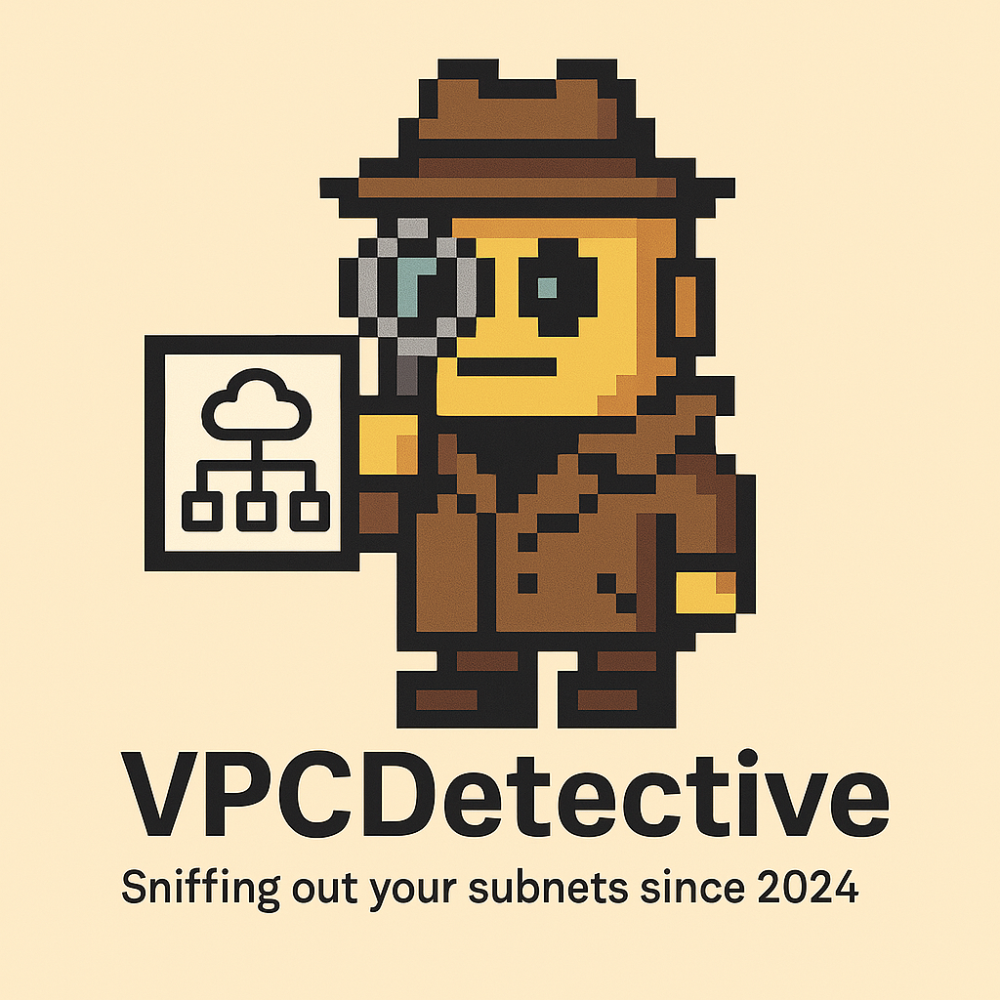

# VPC Detective



VPC Detective is a tool that helps AWS administrators get a comprehensive view of their VPC infrastructure across multiple AWS accounts and regions. It automatically collects VPC information and generates a markdown report for easy review.

## Features

- **Multi-Account Support**: Scan VPCs across multiple AWS accounts using AWS SSO
- **Multi-Region Support**: Examine VPCs in multiple regions for each account
- **Comprehensive VPC Information**: Collects key details about each VPC:
  - VPC Name and ID
  - CIDR Block
  - Default VPC status
  - Internet Gateway presence
  - NAT Gateway count
  - Subnet count
- **Complete Coverage**: Shows all configured accounts and regions, even when no VPCs are present

## Prerequisites

- Python 3.6+
- AWS SSO configured
- Appropriate permissions to describe VPCs, subnets, internet gateways, and NAT gateways
- Required Python packages:
  - boto3
  - aws-sso-lib

## Configuration

Create an `account-list.json` file with your AWS account information:

```json
{
    "SSO": {
        "start_url": "https://your-sso-portal.awsapps.com/start",
        "region": "us-east-1"
    },
    "Accounts": [
        {
            "name": "production",
            "id": "123456789012",
            "role_name": "AdministratorAccess",
            "regions": ["us-east-1", "us-west-2"]
        },
        {
            "name": "development",
            "id": "210987654321",
            "role_name": "AdministratorAccess",
            "region": "us-east-1"
        }
    ]
}
```

Note: You can specify either a single `region` or multiple `regions` for each account.

## Usage

Run the script:

```bash
python vpc-detective.py
```

The script will:
1. Authenticate with AWS SSO
2. Scan each account and region for VPC information
3. Generate a markdown report (`vpc-documentation.md`)

## Output

The script generates a markdown file (`vpc-documentation.md`) with a structured report of all VPCs across your accounts and regions. Here's an example of the output format:

```markdown
# VPC Detective
## Sniffing out your subnets since 2025
*Generated on: 2025-03-27 15:08:43*

## Account: production (123456789012)

### Region: us-east-1

| VPC Name | VPC ID | CIDR Block | Default | IGW | NAT GWs | Subnets |
|---------|--------|------------|---------|-----|---------|--------|
| Main-VPC | vpc-0abc123def456 | 10.0.0.0/16 | No | Yes | 3 | 9 |
| Default VPC | vpc-0123456789abcdef | 172.31.0.0/16 | Yes | Yes | 0 | 6 |

### Region: us-west-2

| VPC Name | VPC ID | CIDR Block | Default | IGW | NAT GWs | Subnets |
|---------|--------|------------|---------|-----|---------|--------|
| DR-VPC | vpc-0def456abc789 | 10.1.0.0/16 | No | Yes | 2 | 6 |

## Account: development (210987654321)

### Region: us-east-1

| VPC Name | VPC ID | CIDR Block | Default | IGW | NAT GWs | Subnets |
|---------|--------|------------|---------|-----|---------|--------|
| Dev-VPC | vpc-0xyz987abc654 | 10.2.0.0/16 | No | Yes | 1 | 4 |
| *No VPCs found* | - | - | - | - | - | - |
```

## Benefits

- **Quick Infrastructure Assessment**: Easily see all VPCs across your AWS organization
- **Identify Unused Resources**: Spot empty regions or accounts with no VPCs
- **Documentation**: Generate up-to-date documentation of your VPC infrastructure
- **Compliance**: Help with auditing and compliance by maintaining infrastructure documentation

## Project Structure

```
vpc-detective/
├── vpc-detective.py         # Main script
├── README.md                # Project documentation
├── requirements.txt         # Python dependencies
├── LICENSE                  # MIT License
├── account-list.example.json # Example configuration file
├── .gitignore              # Git ignore file
├── images/                 # Project images
│   └── vpcdetective.png    # Project logo
└── examples/
    └── vpc-documentation-example.md  # Example output
```

## Installation

1. Clone the repository:
   ```bash
   git clone https://github.com/yourusername/vpc-detective.git
   cd vpc-detective
   ```

2. Install the required packages:
   ```bash
   pip install -r requirements.txt
   ```

3. Create your `account-list.json` file based on the example:
   ```bash
   cp account-list.example.json account-list.json
   # Edit account-list.json with your AWS account details
   ```

## License

GNU General Public License v3.0. See [LICENSE](LICENSE) file for details.
